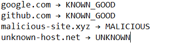

# SOC Network Traffic Analysis & Threat Intelligence Enrichment Pipeline

## SOC Analyst / Cybersecurity Engineer / Threat Hunter Project

---

## 🧭 Project Summary

This project implements a lightweight SOC-style network security pipeline that analyzes packet capture (PCAP) files, extracts network indicators, and enriches them with threat intelligence to detect suspicious or malicious communication patterns.

It simulates real-world SOC workflows including network traffic analysis, IOC enrichment, asset baselining, and alert triage to identify potential command-and-control (C2) activity and unknown external communications.

---

## 🛠️ Features

### 🔍 PCAP Network Traffic Analysis

* Parses Wireshark-generated `.pcap` files using Python
* Extracts key indicators:

  * DNS query logs
  * HTTP host headers
  * TLS SNI (encrypted traffic metadata)
* Supports analysis of both encrypted and unencrypted traffic

### 📊 Known Host Baseline System

* Maintains a lightweight allowlist of trusted domains (CSV-based)
* Includes:

  * Cloud providers
  * SaaS platforms
  * Internal infrastructure
* Reduces false positives by filtering known-safe traffic

### 🌐 Threat Intelligence Enrichment

* Integrates VirusTotal API for external reputation analysis
* Enriches unknown hosts with:

  * Malicious / suspicious scores
  * Vendor detection results
  * Community threat intelligence

### ⚖️ Host Classification Engine

Each host is classified into one of the following categories:

* `KNOWN_GOOD`
* `LIKELY_SAFE_BUT_UNKNOWN`
* `SUSPICIOUS`
* `MALICIOUS`

This enables rapid triage of network-based security events.

---

## 🧠 Security Capabilities Demonstrated

* Network Traffic Analysis (NTA)
* PCAP forensic investigation
* Command-and-Control (C2) detection concepts
* Threat intelligence correlation (IOC enrichment)
* Asset baseline vs anomaly detection
* Security event classification and triage logic
* Behavioral analysis of network communications

---

## 🏗️ Architecture

```text
PCAP Capture (Wireshark / TShark)
          ↓
Python PCAP Parser (PyShark)
          ↓
Protocol Extraction (DNS / HTTP / TLS SNI)
          ↓
Known Host Baseline Lookup (CSV)
          ↓
VirusTotal API Enrichment
          ↓
Risk Classification Engine
          ↓
CSV Report Generation
          ↓
Security Analysis Output
```

---

## 📸 Sample Output

```text
google.com → KNOWN_GOOD
github.com → KNOWN_GOOD
cdn.cloudflare.com → KNOWN_GOOD
unknown-beacon.net → LIKELY_SAFE_BUT_UNKNOWN
malicious-c2-domain.xyz → MALICIOUS
suspicious-update.site → SUSPICIOUS
```

---

## 🖥️ Terminal View

Example execution of the SOC PCAP Analysis tool showing host extraction, VirusTotal enrichment, and risk classification.



---

## 📊 Example CSV Report

The tool automatically generates a CSV report for further investigation.

```csv
host,classification
google.com,KNOWN_GOOD
github.com,KNOWN_GOOD
malicious-c2-domain.xyz,MALICIOUS
unknown-beacon.net,LIKELY_SAFE_BUT_UNKNOWN
```

---

## ⚙️ Technologies Used

* Python 3
* Wireshark / TShark
* PyShark
* VirusTotal API
* Pandas
* Requests
* Python-dotenv

---

## 📂 Project Structure

```text
soc-pcap-analyzer/
│
├── src/
│   ├── main.py
│   ├── pcap_parser.py
│   ├── vt_client.py
│   ├── classifier.py
│   └── storage.py
│
├── data/
│   ├── known_hosts.csv
│   └── sample.pcap
│
├── reports/
│   ├── results.csv
│   └── sample_output.txt
│
├── screenshots/
│   └── sample_output.PNG
│
├── .env.example
├── .gitignore
├── requirements.txt
└── README.md
```

---

## 🎯 SOC Use Cases

### SOC Analyst

* PCAP investigation for security incidents
* IOC validation and enrichment
* Alert triage and classification
* Identifying suspicious external communications

### Cybersecurity Engineer

* Security automation pipeline development
* Threat intelligence integration
* Detection engineering workflows
* SOC toolchain prototyping

### Threat Hunter

* Detection of anomalous outbound connections
* Identification of C2 beaconing patterns
* Baseline vs deviation analysis
* Investigation of unknown external hosts

---

## 🚀 Advantages

* Lightweight alternative to full SIEM deployments
* Automates manual PCAP analysis
* Combines network forensics with threat intelligence
* Extensible for real-time monitoring or SOC integration
* Bridges raw network traffic with actionable security insights

---

## 🔧 Future Enhancements

* Real-time packet capture monitoring
* SQLite or Elasticsearch storage
* Integration with SIEM platforms
* SOAR automation workflows
* Additional threat intelligence feeds
* MITRE ATT&CK mapping
* AI-assisted incident summaries

---

## 📌 Impact

This project demonstrates a SOC-style detection pipeline that integrates:

* Network forensics
* Threat intelligence enrichment
* Security automation
* Risk-based classification

It reflects real-world SOC workflows used to identify suspicious, malicious, and anomalous network behavior.

---

## 🧾 Resume Summary

Built a Python-based SOC pipeline that analyzes PCAP network traffic, extracts DNS/HTTP/TLS indicators, and enriches unknown hosts using VirusTotal API to classify and detect potential malicious communications.
